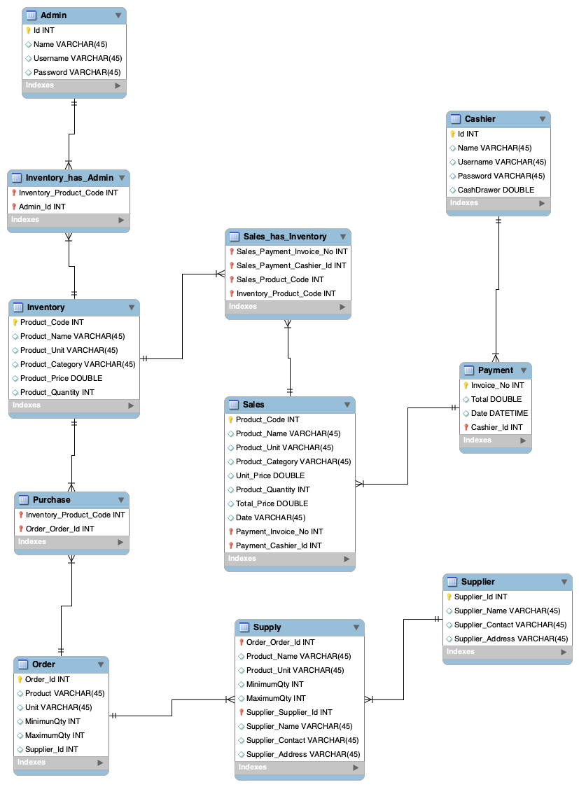
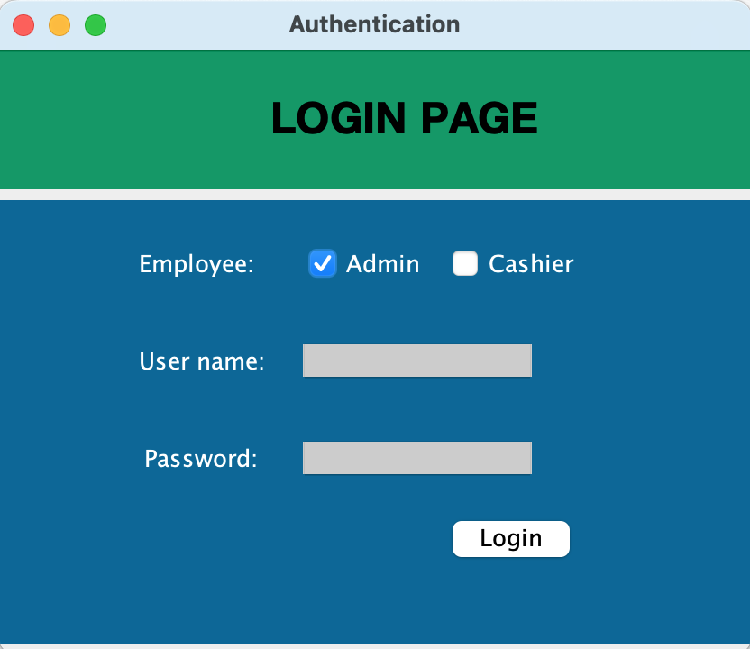
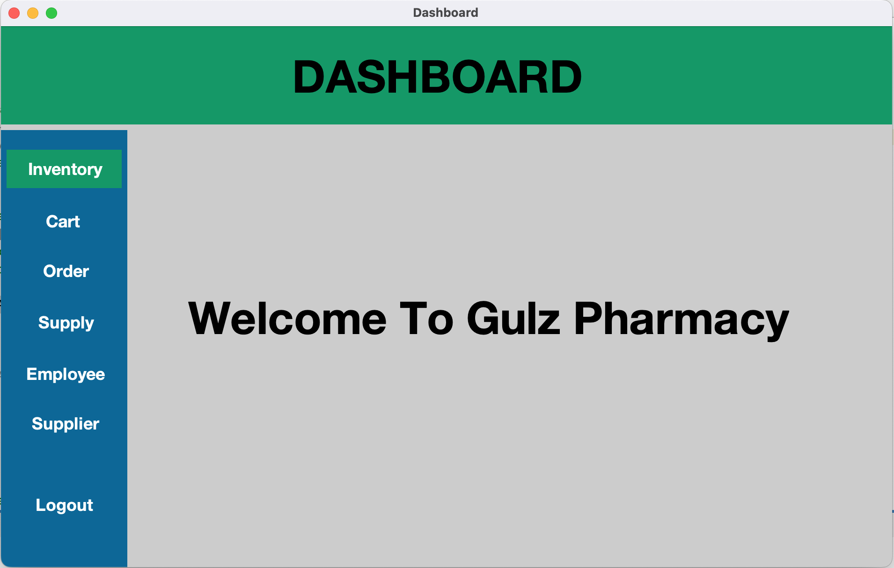
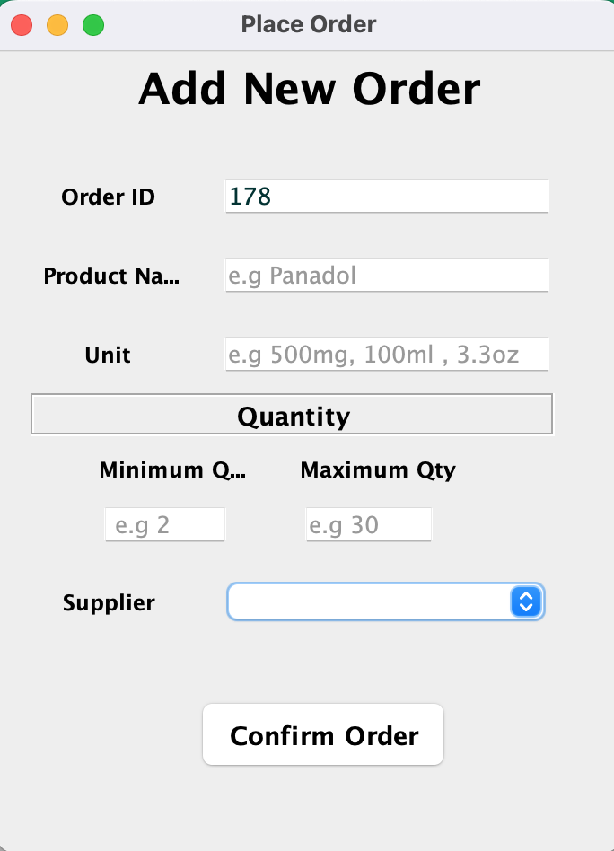

# Pharmacy POS System

## Table of Contents
- [Pharmacy POS System](#pharmacy-pos-system)
  - [Table of Contents](#table-of-contents)
  - [Introduction](#introduction)
  - [Features](#features)
  - [Technologies Used](#technologies-used)
  - [Database Setup](#database-setup)
  - [Usage](#usage)
  - [Reports](#reports)
  - [ERD](#erd)
  - [POS Screenshots](#pos-screenshots)
    - [Login Page](#login-page)
    - [Dashboard](#dashboard)
    - [Order Processing](#order-processing)
  - [Contributing](#contributing)
  - [License](#license)

## Introduction
The Pharmacy POS System is a comprehensive point of sale application designed to manage inventory, cart, orders, supplies, employees, and suppliers specifically for a pharmacy. It generates various reports and integrates with a SQL database. The application is built using Java, with NetBeans as the IDE, leveraging Ant for builds and Swing for the user interface. Jasper Reports is used for generating detailed reports.

## Features
- **Inventory Management**: Track and manage medication inventory levels, product details, and stock movements.
- **Cart Management**: Handle customer shopping carts, add or remove medications, and calculate totals.
- **Order Management**: Process and record customer orders and prescriptions, track order statuses.
- **Supply Management**: Manage supplies, including receiving and logging new stock of medications.
- **Employee Management**: Manage pharmacy employee information and roles.
- **Supplier Management**: Maintain supplier details and manage supplier interactions for medication supplies.
- **Reports**: Generate detailed reports on sales, inventory, orders, and more using Jasper Reports.
- **Database**: Integrated SQL database for storing all system data.

## Technologies Used
- **Java**: Core programming language.
- **Swing**: GUI framework for Java.
- **NetBeans**: Integrated Development Environment (IDE).
- **Ant**: Build automation tool.
- **SQL**: Database language for managing the system's data.
- **Jasper Reports**: Library for generating reports.
- **MySQL Workbench**: Tool for designing and managing SQL databases.

## Database Setup
1. **Entity-Relationship Diagram (ERD)**:
   - The ERD for the database is available in the pos_erd.mwb file. It provides a visual representation of the database schema, including tables and relationships.

2. **SQL Database File**:
   - Use `posDB.sql` to set up the necessary tables and initial data in your MySQL database.

## Usage
- **Login**: Use your employee credentials to log in.
- **Inventory Management**: Navigate to the inventory section to view, add, update, or delete medications.
- **Cart Management**: Use the cart interface to manage customer shopping carts and prescriptions.
- **Order Processing**: Go to the orders section to process new orders and track existing ones.
- **Supply Management**: Access the supplies section to log new medication supplies and manage stock.
- **Employee Management**: Manage pharmacy employee information and roles through the employee section.
- **Supplier Management**: Maintain and update supplier details.
- **Generate Reports**: Use the reports section to generate and view various reports.

## Reports
Jasper Reports is used for generating comprehensive reports. Reports include sales summaries, inventory status, order details, and more. To generate a report:
1. Navigate to the Reports section in the application.
2. Select the desired report type.
3. Configure any report parameters if required.
4. Generate and view the report.

## ERD
The Entity-Relationship Diagram (ERD) for the Pharmacy POS System is provided below. It represents the database schema, including key tables and their relationships.

  
*Figure 1: ERD for the Pharmacy POS System*

## POS Screenshots
Here are some screenshots of the Pharmacy POS System user interface. These images showcase various sections of the application.

### Login Page
  
*Figure 2: Login Page Interface*

### Dashboard
  
*Figure 3: Dashboard Interface*

### Order Processing
  
*Figure 4: Order Processing Interface*

## Contributing
If you would like to contribute to this project, feel free to fork the repository, make your changes, and create a pull request. Please make sure to follow the code of conduct and adhere to the project's coding standards.

## License
This project is licensed under the MIT License - see the [LICENSE.md](LICENSE.md) file for details.

---

*Created by HASNAIN SALEEM*
